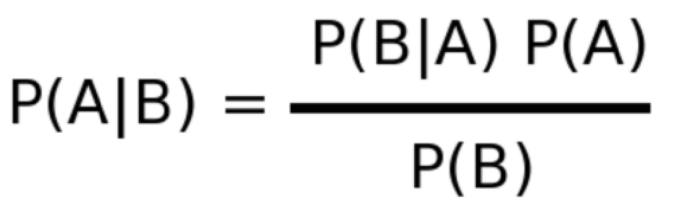

# **Naive Bayes with python - jupyter**

first you have save your dataset in .xlsx file. **you can have how many features you want**. then with pandas it will get you data and save it.

then we start the process:

  - save Features and Labels in two separate Variable
  - separate features with label 1 and 0
  - test our Trained system

Libraries in use:

  - > numpy
  - > pandas
  -  > scipy
